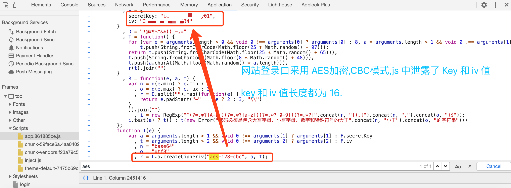
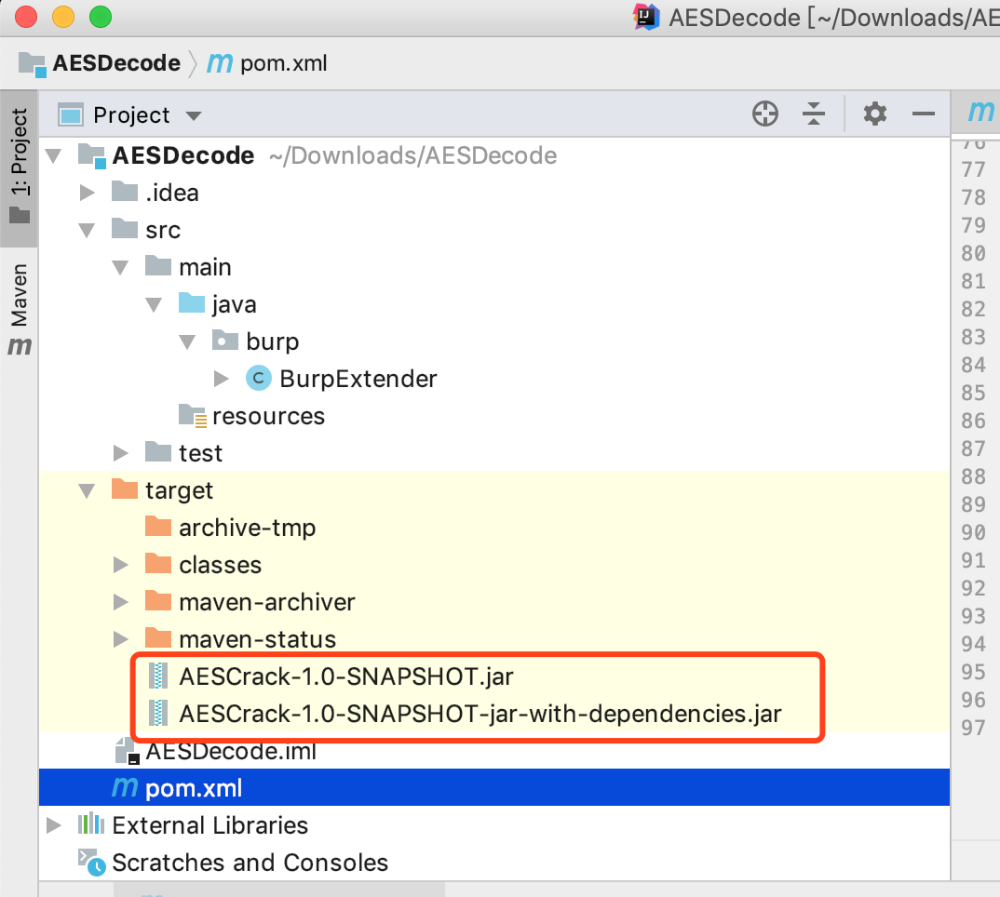
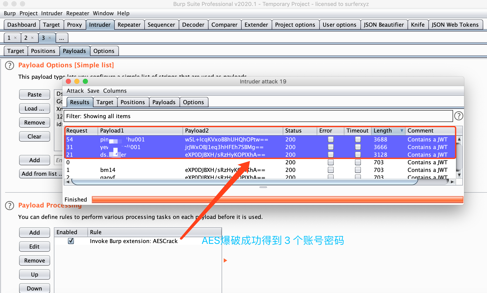

# Burpsuite Plugin For AES Crack

## 0x01 最近遇到挺多网站前端用的 aes 加密登录,就想弄一个 Burpsuite AES 加密爆破插件



## 0x02 查阅资料,造轮子

如何编写自己的Burp Suite插件
https://t0data.gitbooks.io/burpsuite/content/chapter16.html

开发BurpSuite扩展爆破某平台
https://gorgias.me/2017/03/29/%E5%BC%80%E5%8F%91BurpSuite%E6%89%A9%E5%B1%95%E7%88%86%E7%A0%B4%E6%9F%90%E5%B9%B3%E5%8F%B0/

Burpsuite API Javadoc
https://portswigger.net/burp/extender/api/

CoolCat 写的 AesDecode插件,支持菜单页面加密与解密,爆破
https://github.com/TheKingOfDuck/
https://blog.gzsec.org/archives/

c0ny1 的jsEncrypter
https://github.com/c0ny1/jsEncrypter


## 0x03 idea 新建 mvn 项目,pom.xml 中添加依赖

```
    <dependencies>
        <!-- https://mvnrepository.com/artifact/net.portswigger.burp.extender/burp-extender-api -->
        <dependency>
            <groupId>net.portswigger.burp.extender</groupId>
            <artifactId>burp-extender-api</artifactId>
            <version>1.7.22</version>
        </dependency>
    </dependencies>
```

```
    <build>
        <plugins>
            <plugin>
                <groupId>org.apache.maven.plugins</groupId>
                <artifactId>maven-assembly-plugin</artifactId>
                <executions>
                    <execution>
                        <phase>package</phase>
                        <goals>
                            <goal>single</goal>
                        </goals>
                    </execution>
                </executions>
                <configuration>
                    <descriptorRefs>
                        <descriptorRef>jar-with-dependencies</descriptorRef>
                    </descriptorRefs>
                </configuration>
            </plugin>
        </plugins>
    </build>
```
## 0x04 新建包名 burp, java 类 BurpExtender,实现 AES 加密方法
IBurpExtender  官方必须要implements

IIntruderPayloadProcessor 由于我们要用到Intruder的爆破功能即可,所以需要implements

```
public class BurpExtender implements IBurpExtender, IIntruderPayloadProcessor {
    private static IExtensionHelpers helpers;
    public final static String extensionName = "AESCrack"; // 插件名称
    public final static String version = "1.0";
    public final static String AES_IV = "1234567812345678"; // 设置 AES IV 值
    public final static String AES_KEY = "key12345key67890"; // 设置 AES KEY 值
```

##### encryptAES (设置  AES iv 值)

```
    public static String encryptAES(String paramString1, String paramString2)
            throws InvalidKeyException, NoSuchAlgorithmException, NoSuchPaddingException, UnsupportedEncodingException, InvalidAlgorithmParameterException, IllegalBlockSizeException, BadPaddingException {
        SecretKeySpec key = new SecretKeySpec(paramString2.getBytes(), "AES");
        IvParameterSpec iv = new IvParameterSpec("your-iv-value".getBytes()); //set iv
        Cipher cipher = Cipher.getInstance("AES/CBC/PKCS5Padding");
        cipher.init(1, key, iv);
        return helpers.base64Encode(cipher.doFinal(paramString1.getBytes()));
    }

```

processPayload 方法 (设置 AES KEY)

```
    public byte[] processPayload(byte[] currentPayload, byte[] originalPayload, byte[] baseValue) {
        String dataParameter = helpers.bytesToString(currentPayload);
        String AesEncodeStr = null;
        try {
            AesEncodeStr = encryptAES(dataParameter, "your-aes-key"); //set aes key
        } catch (InvalidKeyException e) {
            e.printStackTrace();
        } catch (NoSuchAlgorithmException e) {
            e.printStackTrace();
        } catch (NoSuchPaddingException e) {
            e.printStackTrace();
        } catch (UnsupportedEncodingException e) {
            e.printStackTrace();
        } catch (InvalidAlgorithmParameterException e) {
            e.printStackTrace();
        } catch (IllegalBlockSizeException e) {
            e.printStackTrace();
        } catch (BadPaddingException e) {
            e.printStackTrace();
        }
        return helpers.stringToBytes(AesEncodeStr);
    }
```

## 0x05 idea mvn 编译

Intellij-idea 如何编译maven工程
https://blog.csdn.net/u013044029/article/details/71681891

编译运行成功,在 target 目录,得到 aes.jar 文件

一个没有依赖(文件小) `AESCrack-1.0-SNAPSHOT.jar`
一个有依赖(文件大) `AESCrack-1.0-SNAPSHOT-jar-with-dependencies.jar`

Burpsuite 加载插件时,使用没有依赖的就行了 `AESCrack-1.0-SNAPSHOT.jar`




## 0x06 AES 爆破效果




